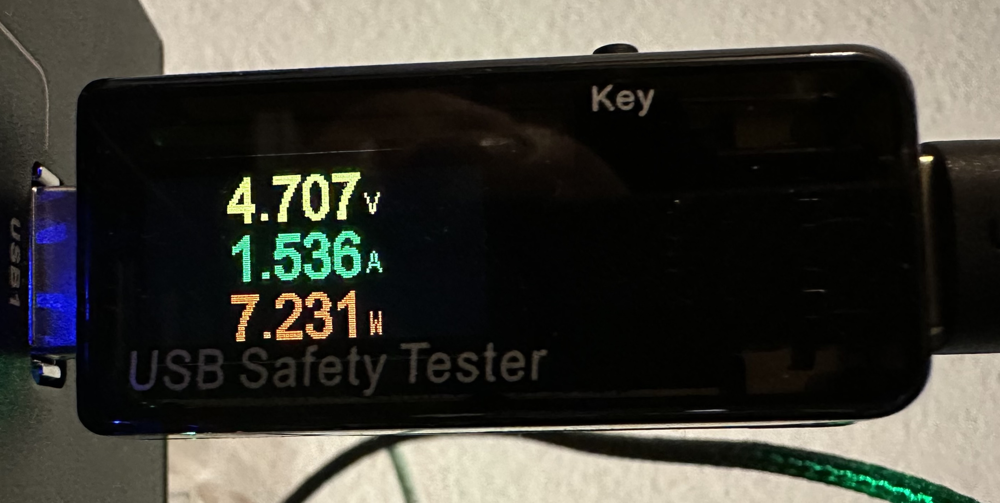

description: Ein erster Einstieg in USB-MIning.

# ☀ Single USB-Miner

Hier wird die Basis zum Mining geschaffen mit Fokus auf die Hardware.

Zur Ermittlung der Leistungsfähigkeit des USB-Miners in der jeweiligen Hardware-Konfiguration wird das Auto-tuning der cgminer-Software verwendet:

```shell
// sudo cgminer -o stratum:dbv8237893278942347 -p x hskefhsuhfoiuse
```

Der USB-Miner nimmt sich die Leistung die er benötigt für die eingestellte Taktrate. Durch das Auto-tuning können wir die Taktrate in MHz so lange erhöhen, bis sich der Algorithmus von cgminer auf eine stabile Taktrate einpendelt, hier sind das ca. 330MHz.&#x20;

<figure><figcaption><p>Wird durch anderes Bild ersetzt.</p></figcaption></figure>

Die Leistungsfähigkeit bei 330MHz sind in meinem Fall 230GH/s (Gigahashes pro Sekunde).

Bei angestecktem USB-Tester sehen wir die angelegte Spannung (in Volt), den verwendeten Strom (in Ampere) und die daraus resultierende elektrische Leistung (in Watt):

<figure><figcaption><p>USB Safety Tester</p></figcaption></figure>

Aktive (mit Netzteil) Standard-USB-Hubs mit einem Gekkoscience Compaq F können hierbei extrem unterschiedlich sein. Ich habe Taktraten von 270MHz bis 545MHz gesehen, je nach verwendetem USB-Hub.&#x20;

<mark style="color:red;">**ACHTUNG**</mark>: höhere Taktraten erfordern aktive Kühlung. &#x20;
