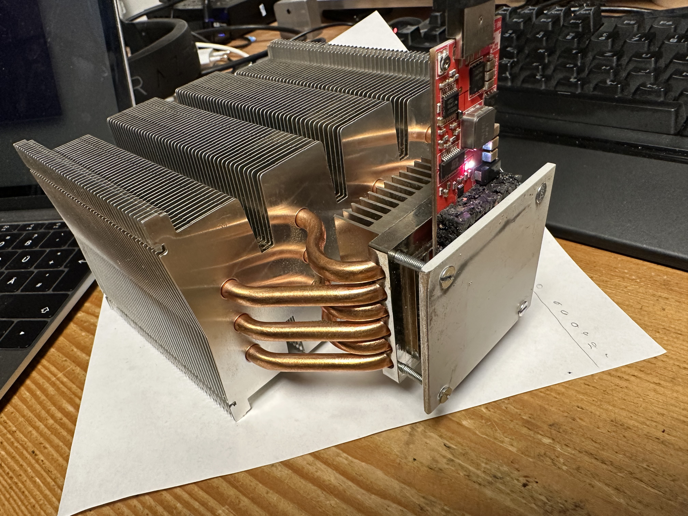
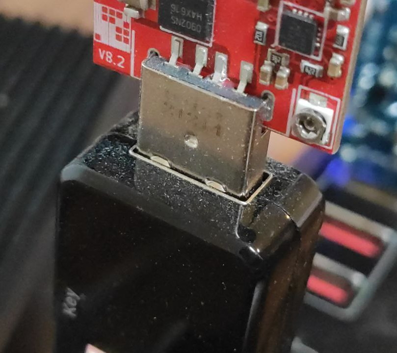
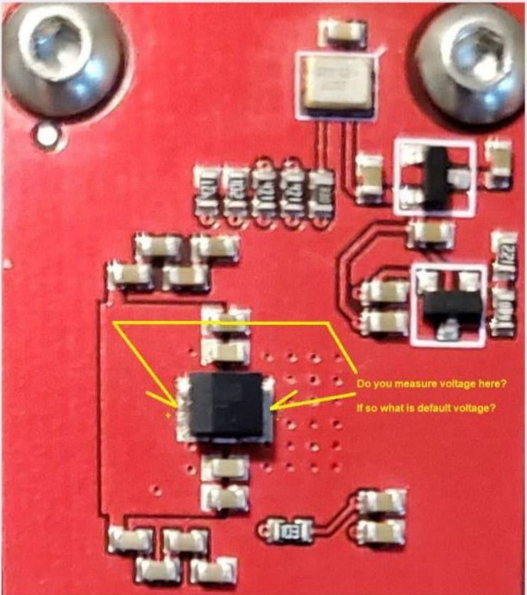
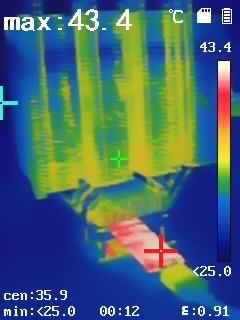
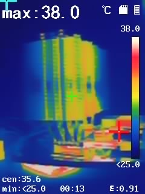

# 🌩 Übertakten

<mark style="color:red;">**ACHTUNG**</mark>: Übertakten sorgt für eine höhere Leistungsaufnahme. Es ist dringend anzuraten sich **vorher** über ein geeignetes Kühlkonzept Gedanken zu machen, da man Gefahr läuft den Chip **dauerhaft zu schädigen**.


Eine kleine Anregung für ausreichende Kühlung:

Hierzu wurde ein CPU-Kühler mit Heatpipes anstatt des Standard-Kühlkörpers verbaut. Unbedingt Wärmeleitpaste verwenden für eine optimale Wärmeableitung.


Die Standard-Spannung liegt bei 1.45V. Aus der Beschreibung des Gekkoscience Compaq F USB-Miners lassen sich des Weiteren folgende Werte als Anhaltspunkt ablesen:

| Frequency (MHz)        | 400  | 500  | 545  | 600  | 700  | 800  |
| ---------------------- | ---- | ---- | ---- | ---- | ---- | ---- |
| USB Hub Power (Ampere) | 2.00 | 2.75 | 3.00 | 3.30 | 4.00 | 5.00 |
| Hash Speed (GH/s)      | 200  | 300  | 366  | 400  | 460  | 550  |

Anmerkung: Je höher die Hashrate desto größer ist die Abweichung vom Durchschnitt, bedingt durch Herstellungstoleranzen des ASIC.

Spannung kann am Potentiometer eingestellt und wie folgt gemessen werden:

<figure><figcaption>
Bild vom Potentiometer
</figcaption></figure>

<figure><figcaption>
Bild vom Spannungsabgriff
</figcaption></figure>

Bild vom Voltmeter:

Zum eigentlichen übertakten kann nun die Core-Spannung von standardmäßig 1.45V durch drehen am Potentiometer erhöht werde. Grundsätzlich sollte die Erhöhung in winzigen Schritten erfolgen mit anschließender Prüfung ob die Kühlung noch ausreicht und ob das Mining noch stabil läuft.

Die Stabilität kann einfach mittels cgminer und dem bereits genannten auto-tuning-Parameter geprüft werden. Gegebenenfalls senkt das auto-tuning die Frequenz automatisch ab.

Die Kühlung zu überprüfen ist hier schon eine größere Herausforderung. Dies kann idealerweise durch eine Wärmebildkamera überprüft werden:

<figure><figcaption>
Wärmeentwicklung mit Standard-USB-Hub: ca. 8W
</figcaption></figure>

 

<figure><figcaption>
Wärmeentwicklung mit Standard-USB-Hub: ca. 8W
</figcaption></figure>

